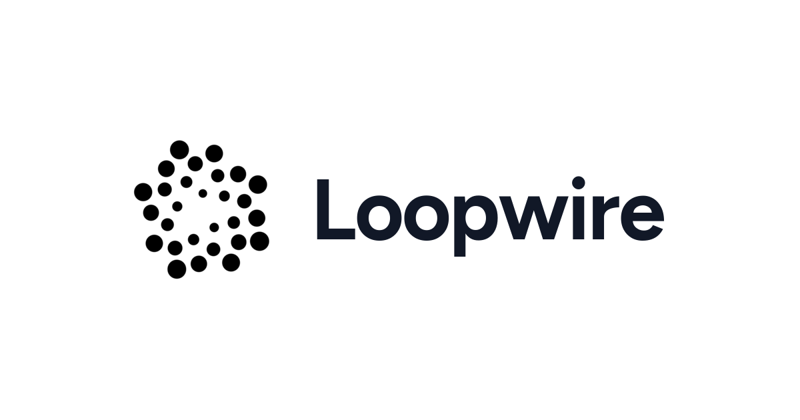

# Loopwire – *Agents write the code. You own the loop.*

<p align="center">
  
</p>

<p align="center">
  <a href="https://qlty.sh/gh/loopwire-dev/projects/loopwire">
    
  </a>
  <a href="https://github.com/loopwire-dev/loopwire/actions/workflows/ci.yml">
    
  </a>
  <a href="https://github.com/loopwire-dev/loopwire/actions/workflows/ship.yml">
    
  </a>
  <a href="LICENSE">
    
  </a>
</p>

Loopwire is a desktop-like platform that helps you run, observe, and steer coding agents from one place.
Instead of juggling terminals, editor tabs, and agent sessions manually, Loopwire gives you a single workflow to keep work organized and under control.

## What Is Loopwire?

Loopwire is where you:

- Start and manage coding-agent sessions.
- Work on your files with an integrated editor and terminal.
- Keep visibility on what agents are doing in real time.
- Stay in control of your local project context.

It is built for people who want practical agent-assisted coding without giving up oversight.

## Why Use Loopwire

- Simpler workflow: one interface instead of scattered tools.
- More control: you decide when to start, stop, and review agent activity.
- Local-first mindset: your day-to-day development context stays on your machine.
- Open source: transparent behavior, inspectable code, community-driven improvements.

## Quick Start

### 1. Install Loopwire

```bash
curl -fsSL https://loopwire.dev/install.sh | sh
```

This installs Loopwire and starts the local daemon automatically.
On macOS and Linux, it also registers daemon auto-start and daily auto-update.

### 2. Open Loopwire in your browser

Go to https://loopwire.dev.

### 3. Find your machine

Use **Scan for machine** to discover your local Loopwire daemon.

### 4. Connect a workspace and begin

- Add or select a project folder.
- Open files in the editor.
- Start an agent session and iterate.

## Security Model

- Daemon listens on localhost by default.
- Bootstrap tokens are single-use.
- Session tokens protect authenticated routes.
- Filesystem access is restricted to registered workspaces.

## Development

### 1. Install moon

https://moonrepo.dev/

### List available tasks

```bash
moon tasks
```

### 2. Bootstrap the repo

From the repo root:

```bash
moon run root:setup
```

If bootstrap cannot install tools automatically in your environment, install the missing tools manually and run `moon run root:setup` again.

### 3. Start development

Run these in two terminals:

```bash
moon run daemon:dev
```

```bash
moon run web:dev
```

### 4. Run checks before pushing

```bash
moon run daemon:quality
moon run web:quality
```

## Contributing

1. Open an issue.
2. Create a focused branch.
3. Submit a PR using the template.
4. Ensure CI passes before review.

## License

MIT
